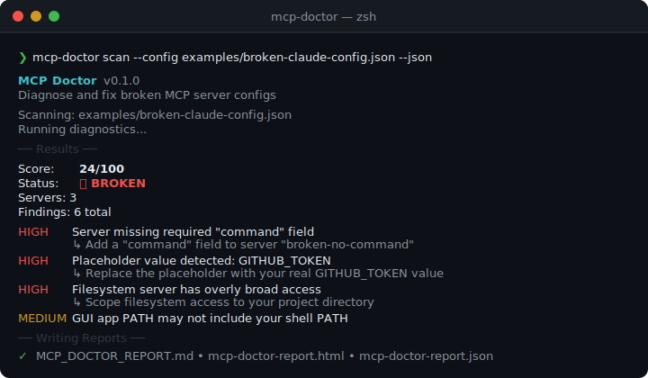
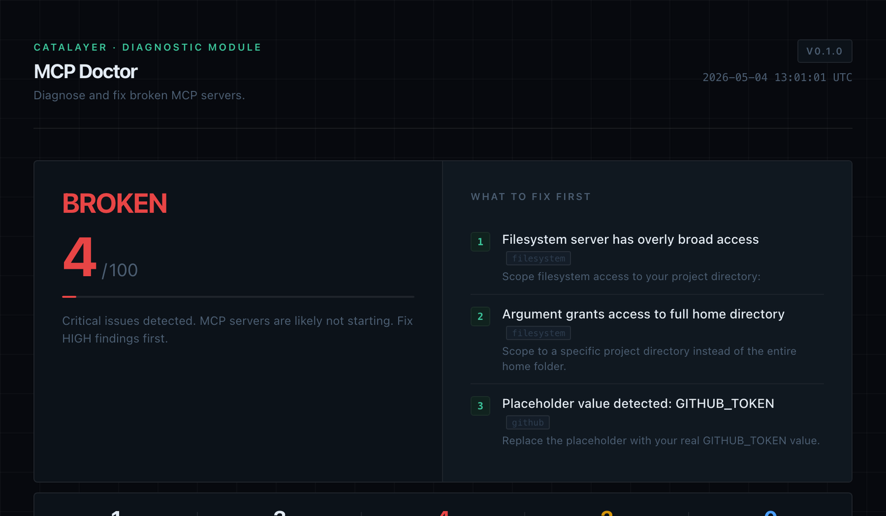

# MCP Doctor

Diagnose, safely install, and audit MCP servers.

MCP Doctor helps developers debug, risk-preview, and safely configure MCP servers before installing them in Claude Desktop, Cursor, VS Code, Cline, Claude Code, Windsurf, and other AI tools.

**Before you paste an MCP config into Claude Desktop or Cursor — run MCP Doctor.**

It checks the real failure points:

- wrong config file location
- invalid JSON
- missing `node`, `npx`, `uv`, `uvx`, `python`, or `docker`
- GUI apps not inheriting your shell PATH (`spawn npx ENOENT`)
- missing env vars and API tokens
- MCP servers showing no tools, prompts, or resources
- unsafe filesystem access (home directory, root, credentials folders)
- high-privilege tokens and secrets in config
- risky server permissions before you install them

## v0.3.0 — Tool Call Audit / Firewall Preview

Before connecting an MCP server to Claude, Cursor, or VS Code, audit what it wants to do:

```bash
# Create a local firewall policy
mcp-doctor firewall init

# Run built-in demo — see severity levels in action
mcp-doctor firewall demo

# Audit a tool call payload from file
mcp-doctor firewall audit --file examples/tool-calls/mixed-batch.json

# Audit from stdin (pipe from any source)
cat my-tool-calls.json | mcp-doctor firewall audit --stdin

# Generate an audit report
mcp-doctor firewall report --file examples/tool-calls/mixed-batch.json
```

**MCP Doctor Tool Call Audit:**
- Classifies every tool call as LOW / MEDIUM / HIGH / CRITICAL
- Detects writes to `.env`, `.ssh`, secrets directories, package files
- Flags shell execution, `rm -rf`, credential arguments, network calls with tokens
- Recommends ALLOW / ASK / BLOCK per call based on your policy file
- Writes `MCP_TOOL_AUDIT_REPORT.md`

**Tool Call Audit is an audit preview, not a live firewall.** Tool calls are analysed statically — nothing is executed or blocked at runtime. A future release may add a live proxy with real-time allow/ask/block controls.

---

## MCP Config Audit

MCP Doctor includes a config audit mode for scanning risky MCP server configurations.

```bash
mcp-doctor config-audit

# Scan a specific config file
mcp-doctor config-audit --config examples/risky-config-audit-config.json
```

Config audit scans:

- Claude Desktop MCP config
- Cursor MCP config
- local MCP JSON config files
- project-level MCP config files such as `.mcp.json` and `.cursor/mcp.json`
- explicit config paths passed with `--config`

MCP configs can be risky because they can grant an AI tool access to local files, shell commands, network services, and API credentials. A small JSON entry can expose the home directory, run an unpinned package through `npx`, launch a shell wrapper, or store tokens in plaintext.

Sample output:

```text
MCP Doctor v0.4.0  Config Audit
Scans MCP server configurations for risky permissions. Local-only. No telemetry.

Configs scanned: 1
Servers found:    3
Findings:         12
Risk score:       100/100 Critical

Detected servers:
  Critical dangerous-shell  bash
  Critical broad-filesystem npx
  High     github-unpinned  npx

Reports written:
  Markdown: MCP_CONFIG_AUDIT_REPORT.md
  JSON:     mcp-config-audit-report.json
```

Reports include scanned config files, detected MCP servers, risk score, risk level, findings grouped by severity, remediation suggestions, and safe configuration recommendations.

Risk score ranges:

| Score | Level |
| --- | --- |
| 0-39 | Low |
| 40-69 | Medium |
| 70-84 | High |
| 85-100 | Critical |

Privacy note:

MCP Doctor runs locally and does not send your MCP configuration, API keys, or project files to any external service.

MCP Doctor is local-first, has no telemetry, does not call external APIs for config auditing, and never executes MCP server commands during the scan.

More detail:

- [Config Audit docs](docs/config-audit.md)
- [Sample Config Audit report](docs/sample-config-audit-report.md)

---

## v0.2.0 — Safe Install Preview

Before trusting any MCP config in an AI tool, inspect it first:

```bash
# Preview risk levels for all servers in a config
mcp-doctor preview ./mcp-config.json

# Detailed per-server inspection with report
mcp-doctor inspect ./mcp-config.json --report

# Generate a safer config with redacted secrets and scoped paths
mcp-doctor safe-config ./mcp-config.json --client claude
```

**MCP Doctor never:**
- executes unknown MCP server packages or scripts
- modifies your real Claude Desktop, Cursor, or VS Code config
- prints secret or token values
- sends data to external services

All analysis is local and offline.

---

```
❯ mcp-doctor scan

  MCP Doctor v0.1.2
  Diagnose and fix broken MCP server configs

  Found 1 config:
    ✓  Claude Desktop: ~/Library/Application Support/Claude/claude_desktop_config.json

  Running diagnostics...

  ── Results ──

  Score:   24/100
  Status:  ❌ BROKEN
  Servers: 3
  Findings: 6 total

  HIGH    Server missing required "command" field  [broken-no-command]
          ↳ Add a "command" field to server "broken-no-command"
  HIGH    Placeholder value detected: GITHUB_TOKEN  [github]
          ↳ Replace the placeholder with your real GITHUB_TOKEN value
  HIGH    Filesystem server has overly broad access  [filesystem]
          ↳ Scope filesystem access to your project directory
  MEDIUM  GUI app PATH may not include your shell PATH  [filesystem]

  ── Writing Reports ──

  ✓  Markdown: MCP_DOCTOR_REPORT.md
  ✓  HTML:     mcp-doctor-report.html

  ❌  BROKEN — Fix HIGH severity issues to get your MCP servers working.
```





---

## Why MCP Doctor Exists

MCP servers fail silently and often. The error messages are unhelpful. The config format is simple JSON — but the failure modes are not:

- `spawn npx ENOENT` — GUI app can't find npx because it doesn't inherit your shell PATH
- Tools don't appear — empty args, missing command, or token not set
- JSON parse error — one missing comma breaks the entire config
- Token set but wrong — placeholder like `YOUR_API_KEY` left in place
- Filesystem server grants access to `/Users` or `/` — works but dangerous

MCP Doctor scans your config, detects these patterns, and tells you exactly what to fix.

---

## Quick Start

**Install from npm** (package is scoped — the unscoped `mcp-doctor` name was already taken):

```bash
npm install -g @stephenywilson/mcp-doctor

mcp-doctor scan
```

**Or build from source:**

```bash
git clone https://github.com/stephenywilson/MCP-Doctor.git
cd MCP-Doctor
npm install
npm run build
npm link

mcp-doctor scan
```

**Common commands:**

```bash
# Scan auto-detected MCP configs
mcp-doctor scan

# Scan a specific config file
mcp-doctor scan --config ~/.cursor/mcp.json

# Scan with JSON output
mcp-doctor scan --json

# Choose output directory
mcp-doctor scan --out ~/Desktop/mcp-report

# List all auto-detected config locations
mcp-doctor list-configs
```

---

## Development

```bash
npm install
npm run build        # compile TypeScript → dist/
npm run typecheck    # type-check without build
npm run smoke        # full smoke test suite
npm run clean        # remove dist/

# Try the broken examples
mcp-doctor scan --config examples/broken-claude-config.json --out /tmp/test --json
```

---

## Safe Install Preview Example

```
mcp-doctor preview examples/safe-install-preview/unsafe-mcp-config.json

  MCP Doctor v0.2.0  Safe Install Preview

  Config:  examples/safe-install-preview/unsafe-mcp-config.json
  Servers: 3

  1. filesystem
     Risk: HIGH
       ─ Grants broad filesystem access: "/Users/stephen"
       ─ Filesystem server detected
       ─ No project-level boundary detected
     ⚠  Safer path: ~/projects/YOUR_PROJECT

  2. github
     Risk: HIGH
       ─ Requires high-privilege credential env var: GITHUB_TOKEN
     Env vars: GITHUB_TOKEN (values not shown)

  3. local-helper
     Risk: HIGH
       ─ Runs local script with relative path: "./scripts/helper.sh"
       ─ Requires high-privilege credential env var: API_SECRET

  Overall: HIGH

  Recommendations:
    • Do not grant access to your home directory.
    • Prefer a project-specific folder: ~/projects/YOUR_PROJECT
    • Use least-privilege tokens.
    • Run: mcp-doctor safe-config <config-path> --client claude
```

---

## What It Checks

| Category | Examples |
| --- | --- |
| Config file | Invalid JSON, missing `mcpServers`, file not found |
| Commands | Shell operators in command, relative paths, missing `command` field |
| Executables | `npx`, `uv`, `uvx`, `node`, `python`, `docker` not found on PATH |
| GUI PATH | macOS apps don't inherit shell PATH — `spawn npx ENOENT` |
| Env/tokens | Empty values, placeholder tokens, secrets in config |
| Args | Empty args for `npx`/`uvx`, non-string values, no package specified |
| Filesystem | Access to root `/`, home `~`, or entire `/Users` |
| Network | GitHub, Slack, Notion, Postgres, browser automation |

Full check list → [docs/what-mcp-doctor-checks.md](docs/what-mcp-doctor-checks.md)

---

## Reports Generated

`mcp-doctor scan` writes two files by default:

| File | Description |
| --- | --- |
| `MCP_DOCTOR_REPORT.md` | Human-readable Markdown report with all findings and fixes |
| `mcp-doctor-report.html` | Visual HTML report — dark theme, score card, server cards, grouped findings |

Add `--json` to also generate `mcp-doctor-report.json` (machine-readable).

Reports are written to the current directory. Use `--out <dir>` to change the output directory.

> Secrets in env vars are always masked (`sk-****`, `ghp_****`). No data is sent to any network.

---

## Supported Clients

Auto-detected config locations:

| Client | Config Path |
| --- | --- |
| Claude Desktop (macOS) | `~/Library/Application Support/Claude/claude_desktop_config.json` |
| Claude Desktop (Windows) | `%APPDATA%\Claude\claude_desktop_config.json` |
| Cursor (project) | `.cursor/mcp.json` |
| Cursor (global) | `~/.cursor/mcp.json` |
| MCP (project root) | `.mcp.json` |

Scan any config: `mcp-doctor scan --config /path/to/config.json`

Client auto-detection is still expanding. More clients in future versions.
See [docs/supported-clients.md](docs/supported-clients.md).

---

## Safe Config Suggestions

MCP Doctor generates suggested fixes inline. Common patterns it suggests:

**Use absolute paths to avoid GUI PATH issues:**
```json
{
  "command": "/opt/homebrew/bin/npx"
}
```

**Scope filesystem access to your project:**
```json
{
  "args": ["-y", "@modelcontextprotocol/server-filesystem", "--directory", "/your/project"]
}
```

**Set real token values:**
```json
{
  "env": {
    "GITHUB_TOKEN": "ghp_yourActualToken"
  }
}
```

MCP Doctor never modifies your config files. Suggestions are in the report only.

---

## Examples

The `examples/` folder contains intentionally broken configs for testing:

| File | What's broken |
| --- | --- |
| `broken-claude-config.json` | Missing command, placeholder token, broad filesystem access |
| `broken-cursor-config.json` | Empty args, shell operators, relative path |
| `filesystem-too-broad.json` | Root `/` and home dir access |
| `missing-env-token.json` | Empty and placeholder env values |
| `invalid-json-example.json` | Syntax error in JSON |

See [examples/README.md](examples/README.md) for expected findings.

---

## Roadmap

### v0.4.0 (current)
- [x] Auto-detect common MCP config locations
- [x] Parse and validate JSON configs
- [x] Diagnose 20+ failure patterns
- [x] Executable availability checks
- [x] GUI PATH warnings (macOS)
- [x] Env/token analysis with secret masking
- [x] Filesystem and network risk checks
- [x] Markdown report
- [x] HTML report (dark theme, score card, server cards)
- [x] JSON report (--json flag)
- [x] Tool Call Audit / Firewall Preview
- [x] Config Audit for MCP server configuration security scanning
- [x] GitHub Actions CI

### Future ideas
- [ ] VS Code / Cline config detection
- [ ] Windsurf config detection
- [ ] Detect common MCP package names and verify they exist on npm/PyPI
- [ ] Suggested config snippets with absolute paths pre-filled
- [ ] `mcp-doctor fix --dry-run` preview mode

### Later ideas
- [ ] Interactive fix wizard
- [ ] Watch mode for config changes
- [ ] Docker-based MCP server checks

---

## Security Notes

- MCP Doctor reads config files and checks local executables only
- No data is sent to any network or external service
- No telemetry, no analytics, no account required
- Secrets in env vars are always masked in reports
- Config files are never modified
- Works fully offline

See [SECURITY.md](SECURITY.md) for vulnerability reporting.

---

## Contributing

Contributions welcome! See [CONTRIBUTING.md](CONTRIBUTING.md).

Found a false positive? Have a new failure pattern to add? Open an issue or PR.

---

## GitHub Topics

Suggest adding these topics to the repo:
`mcp` `mcp-server` `mcp-doctor` `mcp-debug` `mcp-tools` `model-context-protocol` `claude` `claude-desktop` `cursor` `vscode` `cline` `ai-agents` `developer-tools` `typescript`

---

## License

[MIT](LICENSE)
